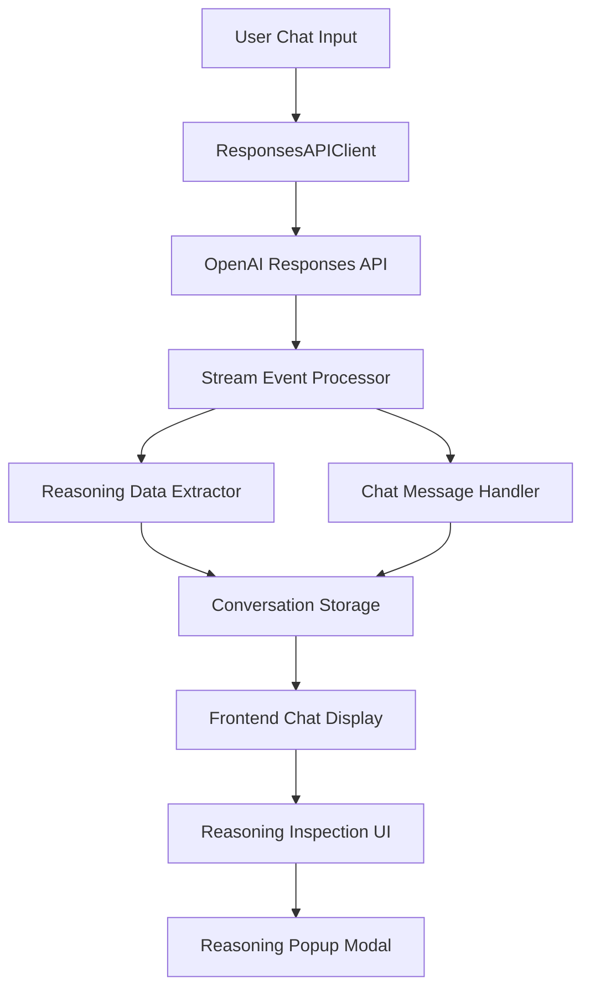

# Design Document

## Overview

The Chat Reasoning Inspection feature adds the ability to capture, store, and display detailed reasoning output from OpenAI's Responses API. This feature integrates seamlessly with the existing chat system by extending the current conversation storage format to include reasoning data and adding a user interface element (info button) to access this information.

The design leverages OpenAI's reasoning capabilities by setting `"summary": "detailed"` in the reasoning configuration and processing the specific reasoning stream events to capture comprehensive reasoning summaries.

## Architecture

### High-Level Architecture



### Component Integration

The feature integrates with existing components:

1. **ResponsesAPIClient**: Modified to include reasoning configuration
2. **ConversationManager**: Extended to store reasoning data with messages
3. **StreamEventProcessor**: Enhanced to capture reasoning events
4. **Frontend Chat Display**: Updated to show inspection buttons
5. **New Reasoning UI Components**: Modal/popup for displaying reasoning details

## Components and Interfaces

### Backend Components

#### 1. Enhanced ResponsesAPIClient

**Location**: `app.py` (existing class)

**Modifications**:
- Add reasoning configuration with `"summary": "detailed"` to API requests
- Process reasoning-specific stream events
- Extract and structure reasoning data for storage

**New Methods**:
```python
def _extract_reasoning_from_stream(self, stream: Any) -> Optional[Dict[str, Any]]:
    """Extract reasoning data from stream events"""
    
def _process_reasoning_events(self, event: Any, reasoning_data: Dict[str, Any]) -> None:
    """Process individual reasoning stream events"""
```

#### 2. Enhanced ChatMessage Model

**Location**: `app.py` (existing Pydantic model)

**Modifications**:
```python
class ChatMessage(BaseModel):
    role: str = Field(..., description="Message role: 'user' or 'assistant'")
    text: str = Field(..., description="Message content")
    timestamp: int = Field(..., description="Unix timestamp when message was created")
    response_id: str | None = Field(None, description="OpenAI response ID for assistant messages")
    reasoning_data: Dict[str, Any] | None = Field(None, description="Reasoning summary data for assistant messages")
```

#### 3. Enhanced ConversationManager

**Location**: `app.py` (existing class)

**New Methods**:
```python
def add_message_with_reasoning(
    self,
    username: str,
    conversation_id: str,
    role: str,
    content: str,
    response_id: str | None = None,
    reasoning_data: Dict[str, Any] | None = None,
) -> None:
    """Add a message with optional reasoning data to a conversation"""

def get_message_reasoning(
    self, username: str, conversation_id: str, message_index: int
) -> Dict[str, Any] | None:
    """Get reasoning data for a specific message"""
```

#### 4. New Reasoning API Endpoint

**Location**: `app.py`

**New Route**:
```python
@app.route("/chat/reasoning/<conversation_id>/<int:message_index>", methods=["GET"])
def get_message_reasoning(conversation_id: str, message_index: int):
    """API endpoint to retrieve reasoning data for a specific message"""
```

### Frontend Components

#### 1. Enhanced Chat Message Display

**Location**: `src/chat.ts` and `src/script.ts`

**Modifications**:
- Add reasoning inspection button to assistant messages
- Handle reasoning button click events
- Integrate with reasoning modal display

**New Functions**:
```typescript
function addReasoningButton(messageElement: HTMLElement, messageIndex: number): void
function showReasoningModal(conversationId: string, messageIndex: number): void
function hideReasoningModal(): void
```

#### 2. New Reasoning Modal Component

**Location**: New CSS and HTML structure

**Features**:
- Modal overlay for reasoning display
- Scrollable content area for long reasoning text
- Close functionality (X button, ESC key, click outside)
- Responsive design for different screen sizes

#### 3. Enhanced Stream Processing

**Location**: `src/script.ts`

**Modifications**:
- Process reasoning stream events alongside text events
- Store reasoning data temporarily during message generation
- Associate reasoning data with completed messages

## Data Models

### Reasoning Data Structure

```typescript
interface ReasoningData {
    summary_parts: string[];
    complete_summary: string;
    timestamp: number;
    response_id: string;
}
```

### Enhanced Message Storage Format

```json
{
    "role": "assistant",
    "text": "Response content...",
    "timestamp": 1704067200,
    "response_id": "resp_abc123",
    "reasoning_data": {
        "summary_parts": ["First part of reasoning...", "Second part..."],
        "complete_summary": "Complete reasoning summary...",
        "timestamp": 1704067200,
        "response_id": "resp_abc123"
    }
}
```

### Stream Event Processing

The system will process these specific reasoning events:
- `response.reasoning_summary_part.added`
- `response.reasoning_summary_text.delta`
- `response.reasoning_summary_text.done`
- `response.reasoning_summary_part.done`

## Error Handling

### Backend Error Scenarios

1. **Missing Reasoning Data**: Gracefully handle cases where reasoning data is not available
2. **Stream Processing Errors**: Continue normal chat functionality if reasoning processing fails
3. **Storage Errors**: Log reasoning storage failures without blocking message storage
4. **API Errors**: Handle cases where reasoning is not supported or fails

### Frontend Error Scenarios

1. **Missing Reasoning Button**: Hide button if no reasoning data is available
2. **Failed Reasoning Fetch**: Show appropriate error message in modal
3. **Modal Display Errors**: Fallback to simple text display if modal fails
4. **Network Errors**: Retry mechanism for reasoning data retrieval

### Error Recovery Strategies

```python
def safe_add_reasoning_data(message: ChatMessage, reasoning_data: Dict[str, Any]) -> None:
    """Safely add reasoning data with fallback handling"""
    try:
        message.reasoning_data = reasoning_data
    except Exception as e:
        logging.warning(f"Failed to add reasoning data: {e}")
        # Continue without reasoning data
```

## Testing Strategy

### Unit Tests

1. **Reasoning Data Extraction**: Test stream event processing and data extraction
2. **Storage Integration**: Test reasoning data storage and retrieval
3. **API Endpoint**: Test reasoning retrieval endpoint with various scenarios
4. **Error Handling**: Test graceful degradation when reasoning is unavailable

### Integration Tests

1. **End-to-End Reasoning Flow**: Test complete reasoning capture and display flow
2. **Chat Functionality**: Ensure existing chat features remain unaffected
3. **Stream Processing**: Test reasoning event processing alongside text events
4. **Storage Compatibility**: Test backward compatibility with existing conversations

### Frontend Tests

1. **UI Component Tests**: Test reasoning button display and modal functionality
2. **Event Handling**: Test click events and modal interactions
3. **Responsive Design**: Test modal display across different screen sizes
4. **Error States**: Test UI behavior when reasoning data is unavailable

### Test Data

```python
# Sample reasoning stream events for testing
SAMPLE_REASONING_EVENTS = [
    {"type": "response.reasoning_summary_part.added", "part": "Initial reasoning..."},
    {"type": "response.reasoning_summary_text.delta", "delta": "Additional reasoning..."},
    {"type": "response.reasoning_summary_text.done", "text": "Complete reasoning summary"},
    {"type": "response.reasoning_summary_part.done", "part_id": "part_1"}
]
```

## Performance Considerations

### Storage Impact

- Reasoning data will increase conversation file sizes
- Implement optional reasoning data cleanup for old conversations
- Consider compression for large reasoning summaries

### Network Impact

- Reasoning data fetched on-demand to minimize initial page load
- Implement caching for frequently accessed reasoning data
- Use efficient JSON serialization for reasoning data transfer

### Memory Impact

- Stream processing will temporarily hold reasoning data in memory
- Implement proper cleanup of reasoning data after storage
- Monitor memory usage during long reasoning sessions

## Security Considerations

### Data Privacy

- Reasoning data contains detailed AI thought processes
- Apply same privacy controls as chat messages
- Ensure reasoning data is properly associated with user sessions

### Access Control

- Reasoning data should only be accessible to the message owner
- Implement proper authentication for reasoning API endpoints
- Validate conversation ownership before returning reasoning data

### Data Sanitization

- Sanitize reasoning data before display to prevent XSS
- Validate reasoning data structure before storage
- Implement proper error messages without exposing internal details