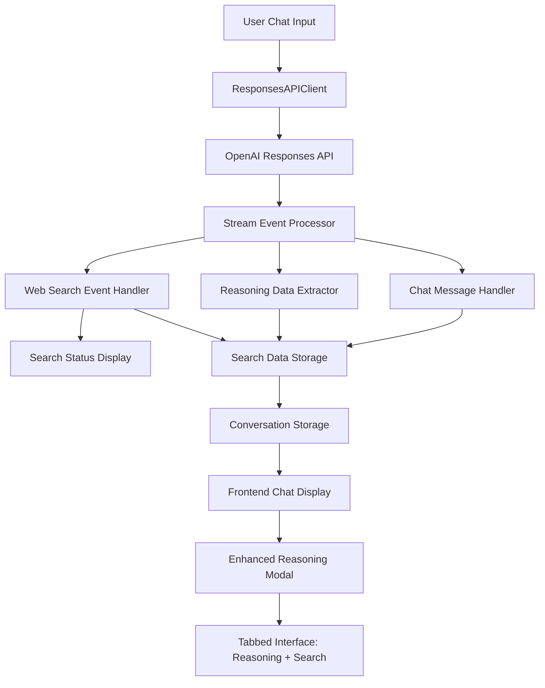

# Design Document

## Overview

The Chat Web Search Events feature extends the existing chat system to handle web search events from OpenAI's Responses API and provide comprehensive status updates for both web searches and reasoning processes. This feature builds upon the existing reasoning inspection system by adding support for three new web search event types: `response.web_search_call.in_progress`, `response.web_search_call.searching`, and `response.web_search_call.completed`, as well as status updates for reasoning events. The design integrates seamlessly with the current stream processing architecture and extends the reasoning modal to display web search information alongside existing reasoning data.

**Key Insights from API Testing**: 
1. **Web Search Events**: Provide metadata (item_id, output_index, sequence_number) but no query/results data
2. **Web Search Output Items**: Available as `ResponseFunctionWebSearch` objects with:
   - `id`: Unique web search call ID (e.g., `ws_68ce5102e5d481949543f9c6f24b9ad30917ec2dabc2f9ff`)
   - `status`: Current status (`in_progress`, `searching`, `completed`, `failed`)
   - `action`: Contains search details when completed (e.g., `ActionSearch(query='weather: United States, New York, New York City', type='search', sources=None)`)
   - `type`: Always `web_search_call`
3. **Message Output Items**: Available as `ResponseOutputMessage` objects with:
   - `content`: Array of content items (text, annotations/citations)
   - `status`: Message status (`in_progress`, `completed`, `incomplete`)
   - `annotations`: Citations from web search results (when available)
4. **Reasoning Items**: Available as `ResponseReasoningItem` objects for reasoning status tracking
5. **Event Correlation**: Web search events and output items can be correlated via `item_id`

The feature provides real-time status updates during web searches and reasoning, stores search metadata for later inspection, and gives users transparency into both when the AI performed web searches and when it was reasoning during response generation.

## Architecture

### High-Level Architecture



### Component Integration

The feature integrates with existing components:

1. **StreamEventProcessor**: Extended to handle web search events
2. **ConversationManager**: Enhanced to store web search data alongside reasoning data
3. **Frontend Chat Display**: Updated to show real-time search status
4. **Reasoning Modal**: Enhanced with tabbed interface for reasoning and search data
5. **New Web Search Components**: Status display and data formatting components

## Components and Interfaces

### Backend Components

#### 1. Enhanced StreamEventProcessor

**Location**: `app.py` (existing class)

**New Event Handlers**:
```python
def _handle_web_search_call_in_progress(self, event: Any) -> None:
    """Handle response.web_search_call.in_progress event"""
    
def _handle_web_search_call_searching(self, event: Any) -> None:
    """Handle response.web_search_call.searching event"""
    
def _handle_web_search_call_completed(self, event: Any) -> None:
    """Handle response.web_search_call.completed event"""
```

**Enhanced Data Structure**:
```python
def __init__(self, event_queue: Queue):
    # Existing initialization...
    self.web_search_data: Dict[str, Any] = {
        "searches": [],
        "current_search": None,
        "total_searches": 0
    }
```

#### 2. Enhanced ChatMessage Model

**Location**: `app.py` (existing Pydantic model)

**Enhanced reasoning_data structure**:
```python
# Extended reasoning_data to include web search information
reasoning_data: Dict[str, Any] | None = Field(None, description="Reasoning and web search data")

# Example structure:
{
    "summary_parts": ["reasoning part 1", "reasoning part 2"],
    "complete_summary": "complete reasoning text",
    "timestamp": 1704067200,
    "response_id": "resp_abc123",
    "web_searches": [
        {
            "query": "search query",
            "status": "completed",
            "results_summary": "brief summary of results",
            "timestamp": 1704067201,
            "search_id": "search_123"
        }
    ]
}
```

#### 3. Enhanced Stream Event Processing

**Location**: `app.py` (existing method)

**Updated _handle_stream_event method**:
```python
def _handle_stream_event(self, event: Any) -> None:
    # Existing event handlers...
    elif event_type == "response.web_search_call.in_progress":
        self._handle_web_search_call_in_progress(event)
    elif event_type == "response.web_search_call.searching":
        self._handle_web_search_call_searching(event)
    elif event_type == "response.web_search_call.completed":
        self._handle_web_search_call_completed(event)
    # Remove the unhandled event warning for these types
```

#### 4. Enhanced Real-time Status Updates

**Location**: `app.py` (existing stream processing)

**New Status Event Types**:
```python
# Web search status events for frontend updates based on actual API data
{
    "type": "search_started",
    "item_id": "ws_68ce4a3b4358819785a2e747631a603e04b6811de0410870",
    "output_index": 1,
    "sequence_number": 336
}

{
    "type": "search_in_progress", 
    "status": "searching",
    "item_id": "ws_68ce4a3b4358819785a2e747631a603e04b6811de0410870",
    "output_index": 1,
    "sequence_number": 337
}

{
    "type": "search_completed",
    "item_id": "ws_68ce4a3b4358819785a2e747631a603e04b6811de0410870",
    "output_index": 1,
    "sequence_number": 338
}

# Reasoning status events for comprehensive process transparency
{
    "type": "reasoning_started",
    "part_id": "part_1"
}

{
    "type": "reasoning_in_progress",
    "status": "thinking"
}

{
    "type": "reasoning_completed",
    "part_id": "part_1"
}
```

### Frontend Components

#### 1. Enhanced Chat Status Display

**Location**: `src/chat.ts` and `src/script.ts`

**New Status Handling**:
```typescript
interface WebSearchStatus {
    type: 'search_started' | 'search_in_progress' | 'search_completed';
    item_id: string;
    output_index: number;
    sequence_number: number;
    status?: string;
}

interface ReasoningStatus {
    type: 'reasoning_started' | 'reasoning_in_progress' | 'reasoning_completed';
    part_id?: string;
    status?: string;
}

function handleWebSearchStatus(status: WebSearchStatus): void {
    // Display search status in current message area
}

function handleReasoningStatus(status: ReasoningStatus): void {
    // Display reasoning status in current message area
}

function updateStatusDisplay(message: string, isActive: boolean, statusType: 'search' | 'reasoning'): void {
    // Update the status indicator in the chat interface
}
```

#### 2. Enhanced Reasoning Modal

**Location**: `templates/index.html` and related CSS/JS

**Updated Modal Structure**:
```html
<div id="reasoning-modal" class="modal reasoning-modal" style="display: none;">
    <div class="modal-content reasoning-modal-content">
        <div class="modal-header">
            <h3>AI Process Details</h3>
            <span class="close" id="reasoning-modal-close">&times;</span>
        </div>
        <div class="modal-body">
            <div class="modal-tabs">
                <button class="tab-button active" data-tab="reasoning">Reasoning</button>
                <button class="tab-button" data-tab="search">Web Searches</button>
            </div>
            <div id="reasoning-loading" class="loading-message">
                Loading process data...
            </div>
            <div id="reasoning-error" class="error-message" style="display: none;">
                <!-- Error message -->
            </div>
            <div id="reasoning-content" class="tab-content" data-tab="reasoning" style="display: none;">
                <!-- Reasoning content -->
            </div>
            <div id="search-content" class="tab-content" data-tab="search" style="display: none;">
                <!-- Web search content -->
            </div>
        </div>
    </div>
</div>
```

#### 3. New Web Search Display Component

**Location**: `src/chat.ts`

**New Functions**:
```typescript
function displayWebSearchData(searchData: WebSearchData[]): void {
    // Format and display web search information
}

function formatSearchResults(search: WebSearchData): string {
    // Format individual search result for display
}

function switchModalTab(tabName: 'reasoning' | 'search'): void {
    // Handle tab switching in the modal
}
```

## Data Models

### Web Search Data Structure

Based on actual API testing:

```typescript
interface WebSearchData {
    item_id: string;  // Unique identifier for the search call
    status: 'in_progress' | 'searching' | 'completed' | 'failed';
    output_index: number;  // Position in the response sequence
    sequence_number: number;  // Event sequence number
    timestamp: number;  // When the event was processed
    query?: string;  // Available when status is 'completed'
    action_type?: string;  // e.g., 'search', 'open_page', 'find_in_page'
    sources?: string[];  // Domain restrictions if any
}

interface MessageData {
    item_id: string;
    role: 'assistant';
    status: 'in_progress' | 'completed' | 'incomplete';
    content_items: ContentItem[];
    annotations: Citation[];
}

interface ContentItem {
    type: 'output_text';
    text: string;
    annotations: Citation[];
}

interface EnhancedReasoningData {
    summary_parts: string[];
    complete_summary: string;
    timestamp: number;
    response_id: string;
    web_searches?: WebSearchData[];
    message_data?: MessageData;
}
```

### Stream Event Data

Based on actual testing with OpenAI's API:

```python
# Web search stream events (for status updates only)
class WebSearchInProgressEvent:
    type: str = "response.web_search_call.in_progress"
    item_id: str  # e.g., "ws_68ce5102e5d481949543f9c6f24b9ad30917ec2dabc2f9ff"
    output_index: int
    sequence_number: int

class WebSearchSearchingEvent:
    type: str = "response.web_search_call.searching"
    item_id: str  # Same as in_progress event
    output_index: int
    sequence_number: int

class WebSearchCompletedEvent:
    type: str = "response.web_search_call.completed"
    item_id: str  # Same as previous events
    output_index: int
    sequence_number: int

# Web search output items (contain actual search data)
class ResponseFunctionWebSearch:
    id: str  # Same as item_id in events
    type: str = "web_search_call"
    status: str  # "in_progress", "searching", "completed", "failed"
    action: Optional[ActionSearch]  # Available when completed
    
class ActionSearch:
    type: str = "search"
    query: str  # e.g., "weather: United States, New York, New York City"
    sources: Optional[List[str]]  # Domain restrictions if any

# Message output items (contain response text and citations)
class ResponseOutputMessage:
    id: str
    type: str = "message"
    role: str = "assistant"
    status: str  # "in_progress", "completed", "incomplete"
    content: List[ResponseOutputText]

class ResponseOutputText:
    type: str = "output_text"
    text: str  # The actual response text
    annotations: List[Citation]  # Web search citations
```

### Enhanced Message Storage Format

Based on actual API data structure:

```json
{
    "role": "assistant",
    "text": "Response content...",
    "timestamp": 1704067200,
    "response_id": "resp_abc123",
    "reasoning_data": {
        "summary_parts": ["First reasoning step...", "Second step..."],
        "complete_summary": "Complete reasoning summary...",
        "timestamp": 1704067200,
        "response_id": "resp_abc123",
        "web_searches": [
            {
                "item_id": "ws_68ce5102e5d481949543f9c6f24b9ad30917ec2dabc2f9ff",
                "status": "completed",
                "output_index": 1,
                "sequence_number": 8,
                "timestamp": 1704067201,
                "query": "weather: United States, New York, New York City",
                "action_type": "search",
                "sources": null
            }
        ],
        "message_data": {
            "item_id": "msg_68ce51063f488194a13dec765454c0660917ec2dabc2f9ff",
            "role": "assistant",
            "status": "completed",
            "content_items": [
                {
                    "type": "output_text",
                    "text": "Right now in New York City: mostly clear, around 62°F (16°C)...",
                    "annotations": []
                }
            ],
            "annotations": []
        }
    }
}
```

## Error Handling

### Backend Error Scenarios

1. **Malformed Web Search Events**: Handle events with missing or invalid data
2. **Search Processing Failures**: Continue normal chat functionality if search processing fails
3. **Storage Errors**: Log search data storage failures without blocking message storage
4. **Event Parsing Errors**: Gracefully handle unparseable search event data

### Frontend Error Scenarios

1. **Missing Search Data**: Hide search tab if no search data is available
2. **Failed Search Display**: Show error message in search tab if data cannot be displayed
3. **Tab Switching Errors**: Fallback to reasoning tab if search tab fails
4. **Status Update Failures**: Continue normal chat display if search status updates fail

### Error Recovery Strategies

```python
def safe_process_web_search_event(event: Any) -> None:
    """Safely process web search events with comprehensive error handling"""
    try:
        # Process the event
        process_web_search_event(event)
    except Exception as e:
        logging.warning(f"Failed to process web search event: {e}")
        # Continue without search data - don't block chat functionality
```

## Testing Strategy

### Unit Tests

1. **Web Search Event Processing**: Test handling of all three web search event types
2. **Data Structure Integration**: Test web search data storage alongside reasoning data
3. **Stream Processing**: Test web search events don't interfere with existing stream processing
4. **Error Handling**: Test graceful degradation when web search processing fails

### Integration Tests

1. **End-to-End Search Flow**: Test complete web search capture and display flow
2. **Modal Enhancement**: Test tabbed interface functionality with both reasoning and search data
3. **Status Updates**: Test real-time search status display during message generation
4. **Backward Compatibility**: Test that existing conversations without search data still work

### Frontend Tests

1. **Tab Interface**: Test switching between reasoning and search tabs
2. **Search Data Display**: Test formatting and display of web search information
3. **Status Indicators**: Test real-time search status updates in chat interface
4. **Error States**: Test UI behavior when search data is unavailable or malformed

### Test Data

```python
# Sample web search events for testing (based on actual API data)
SAMPLE_WEB_SEARCH_EVENTS = [
    {
        "type": "response.web_search_call.in_progress",
        "item_id": "ws_68ce4a3b4358819785a2e747631a603e04b6811de0410870",
        "output_index": 1,
        "sequence_number": 336
    },
    {
        "type": "response.web_search_call.searching", 
        "item_id": "ws_68ce4a3b4358819785a2e747631a603e04b6811de0410870",
        "output_index": 1,
        "sequence_number": 337
    },
    {
        "type": "response.web_search_call.completed",
        "item_id": "ws_68ce4a3b4358819785a2e747631a603e04b6811de0410870",
        "output_index": 1,
        "sequence_number": 338
    }
]
```

## Performance Considerations

### Storage Impact

- Web search data will add to conversation file sizes
- Implement optional cleanup of old search data
- Consider compression for extensive search results
- Monitor storage growth with search data included

### Network Impact

- Search data fetched with existing reasoning endpoint
- Minimal additional network overhead
- Efficient JSON serialization for search data
- Cache search data with reasoning data

### Memory Impact

- Stream processing will hold search data temporarily
- Implement proper cleanup after storage
- Monitor memory usage during multiple concurrent searches
- Optimize search data structure for memory efficiency

## Security Considerations

### Data Privacy

- Web search data may contain sensitive query information
- Apply same privacy controls as reasoning data
- Ensure search data is properly associated with user sessions
- Consider search data in conversation sharing/export features

### Access Control

- Search data should only be accessible to message owner
- Implement proper authentication for search data endpoints
- Validate conversation ownership before returning search data
- Apply rate limiting to search data requests

### Data Sanitization

- Sanitize search data before display to prevent XSS
- Validate search data structure before storage
- Implement proper error messages without exposing internal details
- Filter potentially sensitive information from search results

## UI/UX Considerations

### Status Display Design

- Subtle, non-intrusive search status indicators
- Clear visual distinction between search states (in progress, searching, completed)
- Brief, informative status messages
- Smooth transitions between status states

### Modal Enhancement Design

- Clean tabbed interface that doesn't overwhelm users
- Clear visual hierarchy between reasoning and search information
- Responsive design for mobile and desktop
- Intuitive tab switching with keyboard support

### Information Architecture

- Organize search data chronologically
- Group related searches when appropriate
- Provide clear context for each search query
- Balance detail with readability