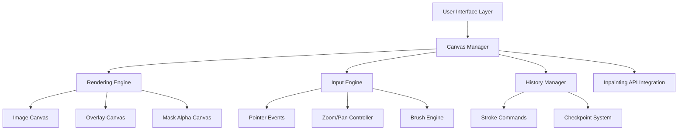

# Design Document

## Overview

The inpainting mask canvas is a sophisticated 2D painting interface that enables users to create precise binary masks for image inpainting operations. The system provides a full-screen popup overlay with professional-grade painting tools, zoom/pan capabilities, and robust undo/redo functionality. The canvas integrates seamlessly with the existing inpainting backend infrastructure, allowing users to selectively edit regions of their generated images with pixel-perfect precision.

The design follows a multi-layered rendering approach with optimized performance targeting 60 FPS during drawing operations. The system maintains strict binary mask data (0 or 255 values only) while providing visual feedback through semi-transparent overlays.

## Architecture

### High-Level Architecture



### Integration with Existing System

The mask canvas integrates with the existing inpainting infrastructure:

- **Frontend Integration**: Extends the current Image tab UI with a mask editing popup
- **Backend Integration**: Generates mask files compatible with existing `InpaintingRequest` model
- **API Integration**: Uses existing `/image` endpoint with `Operation.INPAINT`
- **File System**: Saves masks to user-specific directories following existing patterns

## Components and Interfaces

### 1. InpaintingMaskCanvas (Main Component)

```typescript
interface InpaintingMaskCanvasConfig {
    imageUrl: string;
    containerElement: HTMLElement;
    onMaskComplete: (maskDataUrl: string) => void;
    onCancel: () => void;
}

class InpaintingMaskCanvas {
    private config: InpaintingMaskCanvasConfig;
    private canvasManager: CanvasManager;
    private inputEngine: InputEngine;
    private historyManager: HistoryManager;
    
    constructor(config: InpaintingMaskCanvasConfig);
    public show(): void;
    public hide(): void;
    public exportMask(): string; // Returns data URL
}
```

### 2. CanvasManager (Core Rendering System)

```typescript
interface CanvasState {
    imageWidth: number;
    imageHeight: number;
    viewTransform: Transform2D;
    maskData: Uint8Array;
    isDirty: boolean;
}

class CanvasManager {
    private imageCanvas: HTMLCanvasElement;
    private overlayCanvas: HTMLCanvasElement;
    private maskAlphaCanvas: OffscreenCanvas;
    private state: CanvasState;
    
    public loadImage(imageUrl: string): Promise<void>;
    public updateMask(dirtyRect: Rectangle): void;
    public exportMask(): string;
    public resize(): void;
}
```

### 3. InputEngine (Unified Input Handling)

```typescript
interface BrushSettings {
    mode: 'paint' | 'erase';
    size: number; // 1-200 pixels
    opacity: number; // Always 1.0 for binary masks
}

class InputEngine {
    private brushSettings: BrushSettings;
    private isDrawing: boolean;
    private currentStroke: StrokeCommand | null;
    
    public setBrushMode(mode: 'paint' | 'erase'): void;
    public setBrushSize(size: number): void;
    public handlePointerEvent(event: PointerEvent): void;
    public enableZoomPan(): void;
    public disableZoomPan(): void;
}
```

### 4. BrushEngine (Stamp-Based Drawing)

```typescript
interface Point {
    x: number;
    y: number;
}

interface StrokeCommand {
    mode: 'paint' | 'erase';
    brushSize: number;
    path: Point[];
    timestamp: number;
}

class BrushEngine {
    private stampSpacing: number; // 0.35 * brush diameter
    
    public processStroke(stroke: StrokeCommand, maskData: Uint8Array): Rectangle;
    private stampCircle(center: Point, radius: number, value: number): void;
    private calculateDirtyRect(points: Point[], radius: number): Rectangle;
}
```

### 5. HistoryManager (Undo/Redo System)

```typescript
interface Checkpoint {
    maskData: Uint8Array;
    timestamp: number;
    strokeIndex: number;
}

class HistoryManager {
    private strokes: StrokeCommand[];
    private checkpoints: Checkpoint[];
    private currentIndex: number;
    private maxMemoryMB: number;
    
    public addStroke(stroke: StrokeCommand): void;
    public undo(): boolean;
    public redo(): boolean;
    public createCheckpoint(): void;
    private replayFromCheckpoint(targetIndex: number): void;
}
```

### 6. ZoomPanController (Navigation System)

```typescript
interface Transform2D {
    scale: number;
    translateX: number;
    translateY: number;
}

class ZoomPanController {
    private transform: Transform2D;
    private isActive: boolean;
    
    public handleWheelZoom(event: WheelEvent): void;
    public handlePinchZoom(event: PointerEvent[]): void;
    public handlePan(deltaX: number, deltaY: number): void;
    public screenToImage(screenPoint: Point): Point;
    public imageToScreen(imagePoint: Point): Point;
}
```

## Data Models

### Mask Data Structure

```typescript
interface MaskData {
    width: number;
    height: number;
    data: Uint8Array; // Binary values: 0 or 255
}

interface MaskMetadata {
    version: string;
    created: number;
    imageHash: string;
    totalStrokes: number;
}
```

### Coordinate Systems

```typescript
interface CoordinateSystem {
    // Screen coordinates (CSS pixels)
    screen: {
        width: number;
        height: number;
        devicePixelRatio: number;
    };
    
    // Image coordinates (actual image pixels)
    image: {
        width: number;
        height: number;
    };
    
    // View coordinates (letterboxed image space)
    view: {
        offsetX: number;
        offsetY: number;
        scale: number;
    };
}
```

## Error Handling

### Error Types and Recovery

```typescript
enum MaskCanvasError {
    IMAGE_LOAD_FAILED = 'IMAGE_LOAD_FAILED',
    CANVAS_CONTEXT_FAILED = 'CANVAS_CONTEXT_FAILED',
    MEMORY_EXCEEDED = 'MEMORY_EXCEEDED',
    INVALID_MASK_DATA = 'INVALID_MASK_DATA',
    WEBWORKER_UNAVAILABLE = 'WEBWORKER_UNAVAILABLE'
}

interface ErrorRecoveryStrategy {
    error: MaskCanvasError;
    recovery: () => void;
    fallback?: () => void;
}
```

### Error Handling Strategies

1. **Image Load Failures**: Show error message, allow retry or cancel
2. **Canvas Context Failures**: Fallback to alternative rendering methods
3. **Memory Exceeded**: Automatic cleanup of old history, user notification
4. **Invalid Mask Data**: Reset to clean state, preserve user work when possible
5. **WebWorker Unavailable**: Graceful fallback to main thread processing

## Testing Strategy

### Unit Testing

```typescript
// Example test structure
describe('BrushEngine', () => {
    describe('processStroke', () => {
        it('should create binary mask values only', () => {
            // Test that all mask values are 0 or 255
        });
        
        it('should maintain circular brush shape', () => {
            // Test brush stamp geometry
        });
        
        it('should calculate correct dirty rectangles', () => {
            // Test performance optimization
        });
    });
});

describe('HistoryManager', () => {
    describe('undo/redo', () => {
        it('should provide deterministic replay', () => {
            // Test that replay produces identical results
        });
        
        it('should manage memory limits', () => {
            // Test memory management
        });
    });
});
```

### Integration Testing

```typescript
describe('InpaintingMaskCanvas Integration', () => {
    it('should integrate with existing inpainting API', () => {
        // Test full workflow from mask creation to inpainting
    });
    
    it('should handle different image aspect ratios', () => {
        // Test letterboxing and coordinate mapping
    });
    
    it('should maintain 60 FPS during drawing', () => {
        // Performance testing
    });
});
```

### Performance Testing

- **Frame Rate Testing**: Automated tests to ensure 60 FPS during drawing
- **Memory Usage Testing**: Monitor memory consumption during extended use
- **Large Image Testing**: Test with high-resolution images (4K+)
- **Touch Device Testing**: Verify touch input responsiveness

### Cross-Browser Testing

- **Canvas API Compatibility**: Test across Chrome, Firefox, Safari, Edge
- **Pointer Events Support**: Verify unified input handling
- **OffscreenCanvas Support**: Test WebWorker fallback behavior
- **Touch Input Behavior**: Test on various touch devices

## Performance Optimizations

### Rendering Optimizations

1. **Dirty Rectangle Updates**: Only redraw changed areas
2. **RequestAnimationFrame Batching**: Batch multiple pointer events per frame
3. **Canvas Context Hints**: Use `desynchronized` and `willReadFrequently` hints
4. **Image Smoothing Control**: Disable smoothing for mask rendering

### Memory Optimizations

1. **Tile-Based Checkpoints**: Store history as 256x256 tiles instead of full images
2. **Stroke Command Compression**: Compress stroke paths for storage
3. **Automatic Cleanup**: Remove old history when memory limits are reached
4. **Lazy Loading**: Load mask data only when needed

### Threading Strategy

```typescript
// WebWorker interface for heavy operations
interface MaskWorkerMessage {
    type: 'PROCESS_STROKE' | 'CREATE_CHECKPOINT' | 'EXPORT_MASK';
    data: any;
    transferables?: Transferable[];
}

// Main thread receives dirty rectangles for UI updates
interface WorkerResponse {
    type: 'STROKE_PROCESSED' | 'CHECKPOINT_CREATED' | 'MASK_EXPORTED';
    dirtyRect?: Rectangle;
    result?: any;
}
```

## UI/UX Design

### Visual Design

- **Full-Screen Overlay**: Dark semi-transparent background (90% opacity)
- **Toolbar**: Floating toolbar with paint/erase tools, brush size, undo/redo
- **Brush Cursor**: Circular preview showing current brush size
- **Mask Overlay**: 40-60% white overlay for masked areas
- **Zoom Controls**: On-screen zoom controls for mouse users

### Interaction Design

- **Tool Selection**: Click to select paint/erase tools
- **Brush Sizing**: Slider with press-and-hold drag resize
- **Drawing**: Natural drawing with pointer capture
- **Navigation**: Pinch-to-zoom, two-finger pan, wheel+modifier zoom
- **History**: Undo/redo buttons with keyboard shortcuts

### Accessibility

- **Keyboard Navigation**: Tab through controls, Enter to activate
- **Screen Reader Support**: ARIA labels for all controls
- **High Contrast**: Ensure sufficient contrast for all UI elements
- **Touch Targets**: Minimum 44px touch targets for mobile

## Integration Points

### Frontend Integration

```typescript
// Integration with existing script.ts
function openInpaintingMaskCanvas(imageUrl: string) {
    const canvas = new InpaintingMaskCanvas({
        imageUrl,
        containerElement: document.body,
        onMaskComplete: (maskDataUrl) => {
            // Submit inpainting request with mask
            submitInpaintingRequest(imageUrl, maskDataUrl);
        },
        onCancel: () => {
            // Close canvas without action
        }
    });
    
    canvas.show();
}
```

### Backend Integration

The mask canvas generates PNG mask files compatible with the existing inpainting infrastructure:

```python
# Existing InpaintingRequest model supports the generated masks
request = InpaintingRequest(
    prompt=prompt,
    provider=Provider.NOVELAI,  # or Provider.OPENAI
    operation=Operation.INPAINT,
    base_image_path=base_image_path,
    mask_path=generated_mask_path,  # From canvas
    # ... other parameters
)
```

### File System Integration

- **Mask Storage**: Save masks to `static/images/{username}/masks/`
- **Naming Convention**: `{timestamp}-{base_image_name}-mask.png`
- **Cleanup**: Automatic cleanup of temporary mask files
- **Metadata**: Store mask creation metadata alongside image metadata

## Security Considerations

### Input Validation

- **Image URL Validation**: Ensure only authorized images can be loaded
- **File Size Limits**: Prevent loading of excessively large images

### Data Protection

- **User Isolation**: Ensure users can only access their own images
- **Temporary Files**: Secure cleanup of temporary mask files

## Browser Compatibility

### Minimum Requirements

- **Canvas API**: Full 2D canvas support
- **Pointer Events**: Level 2 support preferred, fallback to mouse/touch
- **OffscreenCanvas**: Optional, graceful fallback to main thread
- **WebWorkers**: Optional, performance enhancement only

### Fallback Strategies

- **No Pointer Events**: Fallback to separate mouse/touch handlers
- **No OffscreenCanvas**: Process everything on main thread
- **No WebWorkers**: Synchronous processing with progress indicators
- **Limited Memory**: Reduce history depth, more frequent cleanup