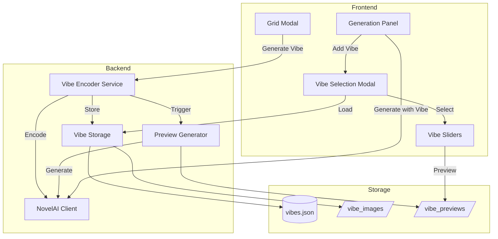

# Design Document: NovelAI Vibe Encoding

## Overview

This feature implements a vibe encoding system for NovelAI image generation. Users can extract visual style information from existing images, store it as reusable "vibes," and apply those vibes to influence the style of new generations. The system includes a backend for encoding and storage, preview image generation for visual comparison, and a frontend UI for browsing and selecting vibes.

## Architecture



## Components and Interfaces

### Backend Components

#### 1. VibeEncoderService (`vibe_encoder.py`)

Handles vibe encoding operations and coordinates with NovelAI API.

```python
from pydantic import BaseModel, Field, field_validator

class VibeEncoding(BaseModel):
    """Single vibe encoding at a specific strength."""
    encoding_strength: float = Field(..., description="Encoding strength (1.0, 0.85, 0.7, 0.5, 0.35)")
    encoded_data: str = Field(..., description="Base64 encoded vibe data")
    
    @field_validator("encoding_strength")
    @classmethod
    def validate_encoding_strength(cls, v: float) -> float:
        valid_strengths = {1.0, 0.85, 0.7, 0.5, 0.35}
        if v not in valid_strengths:
            raise ValueError(f"Encoding strength must be one of {valid_strengths}")
        return v

class VibeCollection(BaseModel):
    """Complete vibe collection with all encodings and preview images."""
    guid: str = Field(..., description="Unique identifier for the collection")
    name: str = Field(..., description="User-provided name")
    model: str = Field(..., description="Model used for encoding")
    created_at: int = Field(..., description="Unix timestamp of creation")
    source_image_path: str = Field(..., description="Path to original source image")
    encodings: dict[str, VibeEncoding] = Field(..., description="Encodings keyed by strength as string")
    preview_images: dict[str, str] = Field(..., description="Preview image paths keyed by 'enc{X}_ref{Y}'")

class VibeEncoderService:
    ENCODING_STRENGTHS = [1.0, 0.85, 0.7, 0.5, 0.35]
    REFERENCE_STRENGTHS = [1.0, 0.85, 0.7, 0.5, 0.35]
    
    def encode_vibe(self, image_path: str, name: str, model: str) -> VibeCollection:
        """Encode image at all strength levels and return collection."""
        
    def _call_encode_api(self, image_b64: str, strength: float, model: str) -> str:
        """Call NovelAI encode-vibe endpoint. Returns encoded_data as base64 string."""
```

#### 2. VibeStorageManager (`vibe_storage.py`)

Manages persistence of vibe collections and preview images.

```python
class VibeStorageManager(UserFileManager):
    """Manages vibe collection storage per user."""
    
    def __init__(self, static_folder: str):
        super().__init__(static_folder, "vibes")
    
    def save_collection(self, username: str, collection: VibeCollection) -> None:
        """Save vibe collection to user's vibes.json and store images."""
        
    def load_collection(self, username: str, guid: str) -> VibeCollection | None:
        """Load a specific vibe collection by GUID."""
        
    def list_collections(self, username: str) -> list[VibeCollectionSummary]:
        """List all vibe collections for a user."""
        
    def delete_collection(self, username: str, guid: str) -> bool:
        """Delete a vibe collection and all associated files."""
        
    def get_encoding(self, username: str, guid: str, encoding_strength: float) -> str | None:
        """Get encoded vibe data for specific strength."""
```

#### 3. VibePreviewGenerator

Generates the 25 preview images for a vibe collection.

```python
class VibePreviewGenerator:
    PREVIEW_WIDTH = 512
    PREVIEW_HEIGHT = 768
    PREVIEW_SEED = 42
    PREVIEW_PROMPT = "1girl, portrait, simple background"
    
    def generate_previews(
        self, 
        username: str,
        collection: VibeCollection,
        novelai_client: NovelAIClient
    ) -> dict[tuple[float, float], str]:
        """Generate all 25 preview images. Returns dict of (enc_str, ref_str) -> path."""
```

#### 4. NovelAI Client Extensions

Add vibe support to existing `NovelAIClient`:

```python
class NovelAIClient:
    # Existing methods...
    
    def encode_vibe(
        self, 
        image_bytes: bytes, 
        information_extracted: float,
        model: str
    ) -> str:
        """
        Encode image to vibe representation.
        
        Returns:
            encoded_b64_data as string
        """
        
    def generate_image(
        self,
        # ... existing params ...
        vibes: list[VibeReference] | None = None,
    ) -> bytes:
        """Extended to support vibe references."""

class VibeReference(BaseModel):
    """Reference to a vibe for image generation."""
    encoded_data: str = Field(..., description="Base64 encoded vibe data")
    reference_strength: float = Field(..., ge=0.0, le=1.0, description="Reference strength 0.0-1.0")
```

### API Endpoints

#### POST `/vibes/encode`
Create a new vibe collection from an existing image.

Request:
```json
{
    "image_filename": "001-portrait.png",
    "name": "Anime Style"
}
```

Response:
```json
{
    "success": true,
    "guid": "550e8400-e29b-41d4-a716-446655440000",
    "name": "Anime Style",
    "preview_count": 25,
    "encoding_count": 5,
    "progress_stream_url": "/vibes/550e8400.../progress"
}
```

#### GET `/vibes/<guid>/progress`
Server-Sent Events endpoint for real-time progress updates during vibe creation.

Response Stream:
```
data: {"phase": "encoding", "step": 1, "total": 5, "message": "Encoding at strength 1.0"}

data: {"phase": "encoding", "step": 5, "total": 5, "message": "Encoding complete"}

data: {"phase": "preview", "step": 1, "total": 25, "message": "Generating preview 1.0x1.0", "preview_url": "/static/vibes/.../preview_enc1.0_ref1.0.thumb.jpg"}

data: {"phase": "complete", "message": "Vibe collection created successfully"}
```

#### GET `/vibes`
List all vibe collections for the current user.

Response:
```json
{
    "collections": [
        {
            "guid": "550e8400-e29b-41d4-a716-446655440000",
            "name": "Anime Style",
            "model": "nai-diffusion-4-5-full",
            "created_at": 1702234567,
            "preview_image": "/static/vibes/user/550e8400.../preview_1.0_1.0.thumb.jpg"
        }
    ]
}
```

#### GET `/vibes/<guid>`
Get details of a specific vibe collection.

Response:
```json
{
    "guid": "550e8400-e29b-41d4-a716-446655440000",
    "name": "Anime Style",
    "model": "nai-diffusion-4-5-full",
    "created_at": 1702234567,
    "encoding_strengths": [1.0, 0.85, 0.7, 0.5, 0.35],
    "previews": {
        "enc1.0_ref1.0": "/static/vibes/user/guid/preview_enc1.0_ref1.0.thumb.jpg",
        "enc1.0_ref0.85": "/static/vibes/user/guid/preview_enc1.0_ref0.85.thumb.jpg"
    }
}
```

#### DELETE `/vibes/<guid>`
Delete a vibe collection.

Response:
```json
{
    "success": true,
    "deleted_files": 31
}
```

#### GET `/vibes/<guid>/preview/<enc_strength>/<ref_strength>`
Get preview image path for specific encoding and reference strength combination.

### Frontend Components

#### 1. Vibe Selection Modal (`vibe-modal.ts`)

```typescript
interface VibeCollection {
    guid: string;
    name: string;
    model: string;
    created_at: number;
    preview_image: string;
}

interface SelectedVibe {
    guid: string;
    name: string;
    encoding_strength: number;
    reference_strength: number;
}

class VibeSelectionModal {
    private collections: VibeCollection[] = [];
    private selectedVibes: SelectedVibe[] = [];
    
    show(): void;
    hide(): void;
    loadCollections(): Promise<void>;
    selectVibe(guid: string): void;
    updatePreview(guid: string, encStrength: number, refStrength: number): void;
    confirmSelection(): SelectedVibe[];
}
```

#### 3. Vibe Progress Modal (`vibe-progress.ts`)

```typescript
interface ProgressUpdate {
    phase: 'encoding' | 'preview' | 'complete';
    step: number;
    total: number;
    message: string;
    preview_url?: string;
}

class VibeProgressModal {
    private eventSource: EventSource | null = null;
    private previewContainer: HTMLElement;
    
    show(progressUrl: string): void;
    hide(): void;
    updateProgress(update: ProgressUpdate): void;
    addPreviewThumbnail(imageUrl: string): void;
    onComplete(callback: () => void): void;
}
```

#### 2. Vibe Panel Component (`vibe-panel.ts`)

Displays selected vibes in the generation form.

```typescript
class VibePanel {
    private vibes: SelectedVibe[] = [];
    private maxVibes: number = 4;
    
    addVibe(vibe: SelectedVibe): boolean;
    removeVibe(guid: string): void;
    updateVibe(guid: string, encStrength: number, refStrength: number): void;
    getVibesForGeneration(): VibeGenerationParams;
    render(): void;
}

interface VibeGenerationParams {
    reference_image_multiple: string[];
    reference_strength_multiple: number[];
}
```

## Data Models

### Vibe Collection JSON Schema

```json
{
    "guid": "string (UUID)",
    "name": "string",
    "model": "string (e.g., nai-diffusion-4-5-full)",
    "created_at": "integer (unix timestamp)",
    "source_image_path": "string",
    "encodings": {
        "1.0": {
            "encoding_strength": 1.0,
            "encoded_data": "string (base64)"
        },
        "0.85": { ... },
        "0.7": { ... },
        "0.5": { ... },
        "0.35": { ... }
    },
    "preview_images": {
        "enc1.0_ref1.0": "/static/vibes/user/guid/preview_enc1.0_ref1.0.png",
        "enc1.0_ref0.85": "/static/vibes/user/guid/preview_enc1.0_ref0.85.png"
    }
}
```

### User Vibes Storage (`static/vibes/{username}/vibes.json`)

```json
{
    "collections": {
        "guid1": { /* VibeCollection */ },
        "guid2": { /* VibeCollection */ }
    }
}
```

### File Naming Convention

```
static/vibes/{username}/{guid}/
├── preview_enc1.0_ref1.0.png      # Generated using vibe (512x768)
├── preview_enc1.0_ref1.0.thumb.jpg # Thumbnail of above
├── preview_enc1.0_ref0.85.png     # Generated using vibe (512x768)
├── preview_enc1.0_ref0.85.thumb.jpg # Thumbnail of above
├── preview_enc0.85_ref1.0.png     # Generated using vibe (512x768)
├── preview_enc0.85_ref1.0.thumb.jpg # Thumbnail of above
├── ... (25 preview pairs total - 5 encoding × 5 reference strengths)
```

## Correctness Properties

*A property is a characteristic or behavior that should hold true across all valid executions of a system-essentially, a formal statement about what the system should do. Properties serve as the bridge between human-readable specifications and machine-verifiable correctness guarantees.*

### Property Reflection

After analyzing the acceptance criteria, I identified the following redundancies:
- Properties related to data storage (1.4, 6.1) can be combined into a single "stored vibe completeness" property
- Properties related to array alignment (3.4, 3.5) can be combined into a single "vibe parameter structure" property
- Properties related to preview file creation (2.5, 2.6) can be combined into a single "preview file completeness" property

### Properties

**Property 1: Encoding strength coverage**
*For any* vibe encoding request, the system should call the encode-vibe API exactly 5 times with the strength values 1.0, 0.85, 0.7, 0.5, and 0.35.
**Validates: Requirements 1.3**

**Property 2: Stored vibe completeness**
*For any* stored vibe collection, the data should contain: a valid GUID, the model name, and for each of the 5 encoding strengths (1.0, 0.85, 0.7, 0.5, 0.35) the encoded base64 data.
**Validates: Requirements 1.4, 1.5, 6.1**

**Property 3: GUID uniqueness**
*For any* two vibe collections created by the system, their GUIDs should be different.
**Validates: Requirements 1.5**

**Property 4: Preview image dimensions**
*For any* generated preview image, the dimensions should be exactly 512x768 pixels.
**Validates: Requirements 2.4**

**Property 5: Preview file completeness**
*For any* preview image generated, both a PNG file and a JPG thumbnail should exist, and the filename should contain both the encoding strength and reference strength values.
**Validates: Requirements 2.5, 2.6**

**Property 6: Vibe count constraint**
*For any* image generation request with vibes, the number of vibes should be between 1 and 4 inclusive.
**Validates: Requirements 3.1**

**Property 7: Encoding strength validation**
*For any* vibe selection, the encoding strength should be one of the valid values: 1.0, 0.85, 0.7, 0.5, or 0.35.
**Validates: Requirements 3.2**

**Property 8: Reference strength range**
*For any* vibe selection, the reference strength should be a float value in the range [0.0, 1.0].
**Validates: Requirements 3.3**

**Property 9: Vibe parameter structure**
*For any* image generation request with vibes, the `reference_image_multiple` and `reference_strength_multiple` arrays should have equal lengths matching the number of vibes.
**Validates: Requirements 3.4, 3.5**

**Property 10: Closest reference strength selection**
*For any* reference strength value, the preview thumbnail should display the image with the closest pre-generated reference strength value from [1.0, 0.85, 0.7, 0.5, 0.35].
**Validates: Requirements 4.5**

**Property 11: Model compatibility validation**
*For any* vibe used in generation, the vibe's model should match the current generation model.
**Validates: Requirements 6.2**

## Error Handling

### API Errors

| Error | HTTP Code | Response |
|-------|-----------|----------|
| Image not found | 404 | `{"error": "Image not found", "error_type": "NotFoundError"}` |
| Invalid encoding strength | 400 | `{"error": "Invalid encoding strength", "error_type": "ValidationError"}` |
| Vibe not found | 404 | `{"error": "Vibe collection not found", "error_type": "NotFoundError"}` |
| Model incompatible | 400 | `{"error": "Vibe incompatible with current model", "error_type": "ValidationError"}` |
| Too many vibes | 400 | `{"error": "Maximum 4 vibes allowed", "error_type": "ValidationError"}` |
| NovelAI API error | 502 | `{"error": "NovelAI encoding failed", "error_type": "ExternalAPIError"}` |

### Frontend Error Handling

- Display toast notifications for API errors
- Show loading spinners during encoding (which takes significant time)
- Disable UI elements during async operations
- Validate vibe count before submission

## Testing Strategy

### Property-Based Testing

The project will use **Hypothesis** for property-based testing in Python.

Each property-based test should:
- Run a minimum of 100 iterations
- Be tagged with the property number and requirements reference
- Use smart generators that constrain inputs to valid ranges

### Unit Tests

- Test vibe encoding service with mocked NovelAI API
- Test storage manager CRUD operations
- Test preview filename generation
- Test closest reference strength calculation
- Test vibe parameter array construction

### Integration Tests

- Test full vibe creation flow (encode → store → generate previews)
- Test vibe usage in image generation
- Test vibe deletion with file cleanup
- Test model compatibility checking
